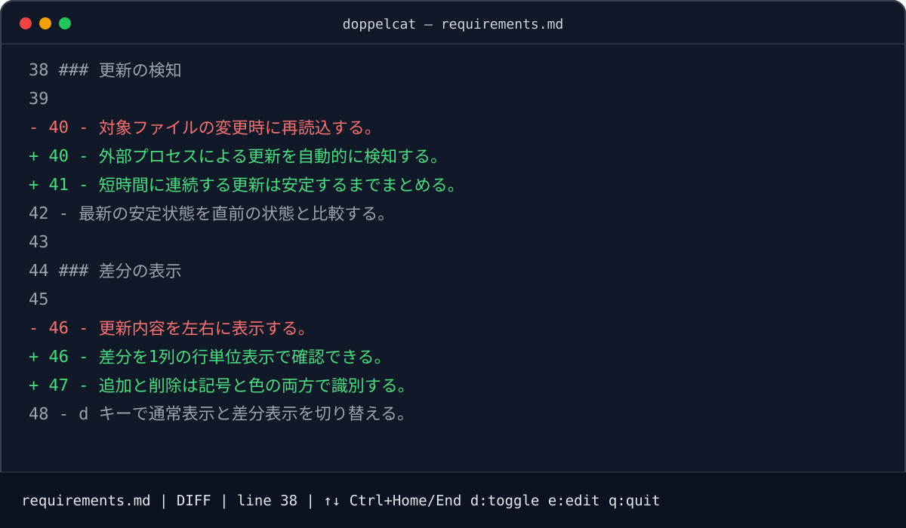

# doppelcat

単一のローカルUTF-8テキストファイルを監視し、更新差分の確認と軽微な編集をターミナル内で完結できるクロスプラットフォームTUIです。

[](https://github.com/asurato/doppelcat/releases/latest)
[](LICENSE)



## 特長

- ファイル更新を自動検知し、直前の安定版との差分を1列で表示
- 追加行を `+`、削除行を `-` と色で識別
- UTF-8 BOM、LF/CRLF/混在改行、末尾改行を保存時に維持
- 選択、コピー、切り取り、貼り付け、Undo/Redoを備えた軽量編集
- 未保存内容と外部更新が競合した場合に、内容を暗黙に破棄しない
- ファイルの削除、再作成、原子的置換を監視し続ける
- ネットワーク通信、テレメトリ、設定ファイル、Git連携なし

## インストール

### ビルド済みバイナリ

[最新のGitHub Release](https://github.com/asurato/doppelcat/releases/latest)からOSとCPUに合うアーカイブを取得し、展開した `doppelcat`（Windowsでは `doppelcat.exe`）をPATHの通った場所へ置いてください。

各アーカイブは `checksums.txt` のSHA-256で検証できます。

### Goでインストール

Go 1.24以上が必要です。

```console
go install github.com/asurato/doppelcat/cmd/doppelcat@latest
```

ソースからビルドする場合:

```console
git clone https://github.com/asurato/doppelcat.git
cd doppelcat
go build -o doppelcat ./cmd/doppelcat
```

## 使い方

既存のUTF-8テキストファイルを1つ指定します。

```console
doppelcat path/to/document.md
```

```console
doppelcat --help
doppelcat --version
```

UTF-8として不正なファイル、NULを含むファイル、ディレクトリは安全に拒否します。OSクリップボードが利用できない環境では、警告を表示してアプリ内クリップボードへフォールバックします。

## キー操作

### 閲覧・差分表示

| キー | 操作 |
|---|---|
| `↑` / `↓` | スクロール |
| `Ctrl+Home` / `Ctrl+End` | 文書の先頭 / 末尾へ移動 |
| `d` | 通常表示 / 差分表示を切り替え |
| `e` | 最新内容を編集 |
| `q` | 終了 |
| `Ctrl+Q` | どの状態からでも終了 |

### 編集

| キー | 操作 |
|---|---|
| 矢印 / `Home` / `End` | カーソル移動 |
| `Shift` + 移動 | 範囲選択 |
| `Ctrl+C` / `Ctrl+X` / `Ctrl+V` | コピー / 切り取り / 貼り付け |
| `Ctrl+Z` / `Ctrl+Y` | Undo / Redo |
| `Ctrl+S` | 保存 |
| `Esc` | 編集を終了 |
| `Ctrl+Q` | 終了確認 |

競合中は `c` で解決ダイアログを再表示できます。外部版の再読込またはローカル版での上書きには最終確認があります。

## 対応環境

- Windows
- macOS
- Linux
- amd64 / arm64

一般的なUnicode対応ターミナルを想定しています。10MB以下の文書では、書き込みが落ち着いてから1秒以内の更新表示を目標としています。

## 開発

```console
go test ./...
go vet ./...
```

要件の詳細は [requirements.md](requirements.md) を参照してください。

## License

[MIT License](LICENSE)
